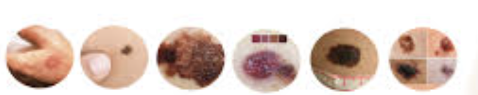

# Skin Cancer Classification App



This is a deep learning project for classifying skin cancer types using a pre-trained ResNet-50 model. The project includes data preprocessing, model training, and a Streamlit web application for predicting skin cancer types from uploaded images.

## Table of Contents
- [Demo](#demo)
- [Getting Started](#getting-started)
- [Prerequisites](#prerequisites)
- [Installation](#installation)
- [Usage](#usage)
- [Model Details](#model-details)
- [Contributing](#contributing)
- [License](#license)

## Demo

You can access the live demo of this skin cancer classification app [here](https://your-app-name.herokuapp.com).

## Getting Started

To get started with this project, follow the instructions below.

### Prerequisites

- Python 3.x
- TensorFlow
- Streamlit

### Installation

Clone the repository:

```bash
git clone https://github.com/your-username/your-repo.git
cd your-repo
```

### Usage

Train the skin cancer classification model by running the provided Jupyter Notebook or script.

Deploy the Streamlit app locally for testing:

```bash
streamlit run app.py
```

### Model Details

The skin cancer classification model uses a pre-trained ResNet-50 model with fine-tuned layers for the task. The model achieves high accuracy in classifying benign and malignant skin lesions.

### Contributing

Contributions are welcome! Especially for the streamlit app interface

### License


